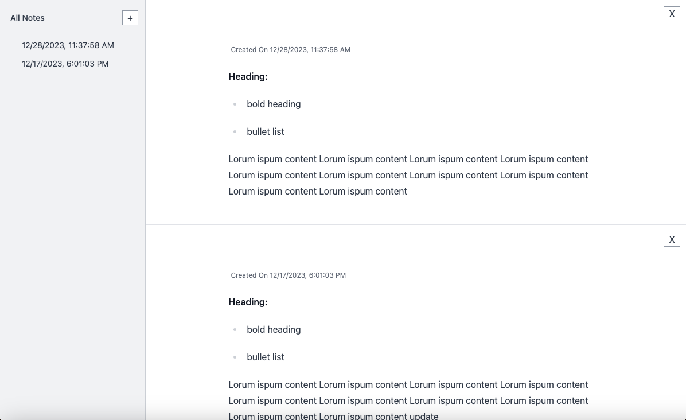

# Offline First Vue Notes
This is a Vue PWA learning project. Add, update or delete notes on or offline.

## Technology Used

1. Vue using Options api
2. Pinia
3. tiptap(https://tiptap.dev/docs/editor/installation/vue3)
4. IndexDB
5. Vite
6. Vue PWA
7. tailwind

## Running Locally

1. fork project
2. npm i
3. npm run dev

### php server
to see the option to download the app locally, 
1. npm run build
2. cd dist
3. php -S localhost:8888

## Completed Features

1. indexdb for storage
2. create, update, delete notes
3. view all notes
4. download a a progressive web app

## Incomplete Todos / Features

1. caching, and look into and add more pwa features
2. tests
3. updated at timestamp

## Resources

1. https://laracasts.com/series/lets-build-an-offline-first-vue-app/
2. https://www.vuemastery.com/blog/getting-started-with-pwas-and-vue3/
3. https://blog.logrocket.com/building-pwa-vue/
4. https://vite-pwa-org.netlify.app/deployment/netlify.html
5. https://github.com/vite-pwa/vite-plugin-pwa/issues/396
6. https://stackoverflow.com/questions/71355290/prevent-service-worker-js-from-being-bundled-with-vite-rollup
7. https://pinia.vuejs.org/getting-started.html
8. https://pinia.vuejs.org/core-concepts/outside-component-usage.html
9. https://vueschool.io/lessons/access-state-from-a-pinia-store
10. https://www.vuemastery.com/blog/advantages-of-pinia-vs-vuex/
11. https://vitest.dev/guide/
12. https://vuejs.org/guide/scaling-up/testing
13. https://css-tricks.com/vitepwa-plugin-offline-service-worker/
14. https://www.codemag.com/Article/2309071/Vite-and-Progressive-Web-Apps